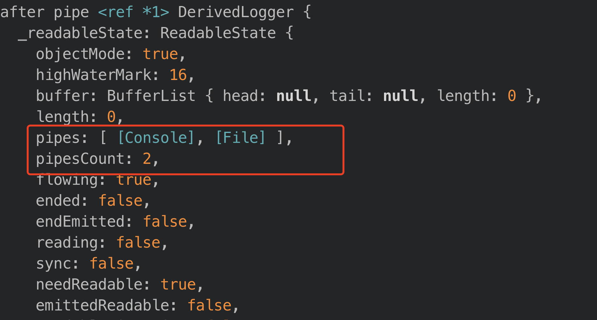
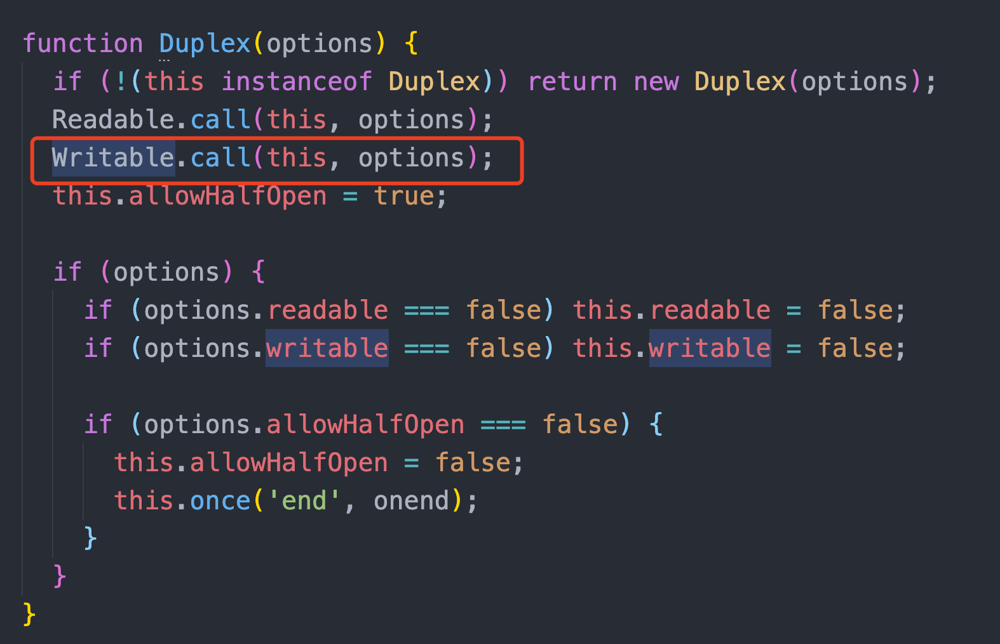
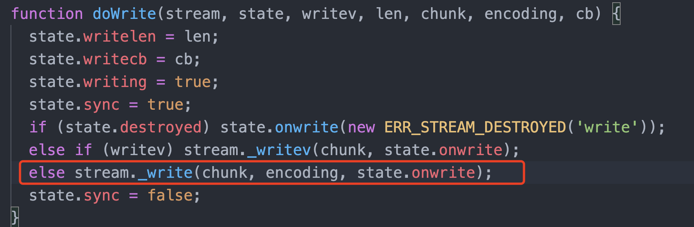

# winston日志方案及原理

相信在实际工作中相比需要收集nodejs日志的同学，都遇到过pm2 + log4js 组合的坑。log4js在cluster模式下是采用所有分线程的日志输出到主线程的，而pm2的cluster模式是所有线程都是分线程， 虽然后来社区里有提供pm2-intercom 进程通讯模块的解决方案，但是这样要在实际运行工程代码的机器上每次安装pm2-intercom(不是物理机)很麻烦又耗时，所以最后就不用log4js 转用winston。单纯觉得为什么这种日志不会直接和console.log一样打在运行的log里，而是能写进一个文件里是个有意思的事，所以简单看看源码。查看的方式还是和以前一样。从入口进，一层一层。

[参考](https://www.jianshu.com/p/20fcb3672723)

## 想学会的点

这个库有很多功能性的东西，我觉得看源码一定是有一定目的去的，而不是把所有的源码都过一遍。所以这里我给出了一个看这个库的目的

先来段代码

```js
const winston = require('winston');

const transports = {
  console: new winston.transports.Console({ level: 'warn' }),
  file: new winston.transports.File({ filename: 'combined.log', level: 'error' })
};
 
const logger = winston.createLogger({
  transports: [
    transports.console,
    transports.file
  ]
});
 
logger.info('Will not be logged in either transport!');
transports.console.level = 'info';
transports.file.level = 'info';
logger.info('Will be logged in both transports!');
```

直接在node环境下运行，我们会发现在控制台会打印出

> {"message":"Will be logged in both transports!","level":"info"}

同时这条信息也会出现在同目录的combined.log文件里面。

**看源码想要探索的问题**

1、transports.console和console.log(有什么区别)

2、transport.file的原理是什么，和fs.writeFile有什么区别

3、在pm2 的cluster模式下，日志写入的方式会有什么不同，会发生写冲突吗？

先来看核心的方法也就是入口，便是这个createLogger了。


### createLogger

其实这个函数只是在logger基础上做了封装，实际功能入口在logger的入口函数

```js
configure({
    silent,
    format,
    defaultMeta,
    levels,
    level = 'info',
    exitOnError = true,
    transports,
    colors,
    emitErrs,
    formatters,
    padLevels,
    rewriters,
    stripColors,
    exceptionHandlers,
    rejectionHandlers
  } = {}) {
    // Reset transports if we already have them
    if (this.transports.length) {
      this.clear();
    }

    this.silent = silent;
    this.format = format || this.format || require('logform/json')();

    this.defaultMeta = defaultMeta || null;
    // Hoist other options onto this instance.
    this.levels = levels || this.levels || config.npm.levels;
    this.level = level;
    this.exceptions = new ExceptionHandler(this);
    this.rejections = new RejectionHandler(this);
    this.profilers = {};
    this.exitOnError = exitOnError;

    // Add all transports we have been provided.
    if (transports) {
      transports = Array.isArray(transports) ? transports : [transports];
      transports.forEach(transport => this.add(transport));
    }

    if (
      colors ||
      emitErrs ||
      formatters ||
      padLevels ||
      rewriters ||
      stripColors
    ) {
      throw new Error(
        [
          '{ colors, emitErrs, formatters, padLevels, rewriters, stripColors } were removed in winston@3.0.0.',
          'Use a custom winston.format(function) instead.',
          'See: https://github.com/winstonjs/winston/tree/master/UPGRADE-3.0.md'
        ].join('\n')
      );
    }

    if (exceptionHandlers) {
      this.exceptions.handle(exceptionHandlers);
    }
    if (rejectionHandlers) {
      this.rejections.handle(rejectionHandlers);
    }
  }
```

接着定位到add函数

```js
add(transport) {
    // 如果打印transport，我们会发现这个transport Console, transport File两个流对象，在这个case下其实就是对这两个流对象加上一些错误和警告的监听
    const target =
      !isStream(transport) || transport.log.length > 2
        ? new LegacyTransportStream({ transport })
        : transport;

    if (!target._writableState || !target._writableState.objectMode) {
      throw new Error(
        'Transports must WritableStreams in objectMode. Set { objectMode: true }.'
      );
    }

    // Listen for the `error` event and the `warn` event on the new Transport.
    this._onEvent('error', target);
    this._onEvent('warn', target);
    // 然后就是这行的含义，this指代的是继承了Transform的DerivedLogger原型，本质上是个stream，通过pipe管道流将外部的target导进原型的pipes对象里,说白了也是对DerivedLogger原型的加工
    this.pipe(target);

    if (transport.handleExceptions) {
      this.exceptions.handle();
    }

    if (transport.handleRejections) {
      this.rejections.handle();
    }

    return this;
  }
```



在完成了基础的加工之后，便到了如何通过info方法实现不同输出这一关键点了,这个方法算是暴露在一开始说的DerivedLogger的表层了

```js
DerivedLogger.prototype[level] = function (...args) {
      // Prefer any instance scope, but default to "root" logger
      const self = this || logger;

      // Optimize the hot-path which is the single object.
      if (args.length === 1) {
        const [msg] = args;
        const info = msg && msg.message && msg || { message: msg };
        info.level = info[LEVEL] = level;
        self._addDefaultMeta(info);
        self.write(info);
        return (this || logger);
      }

      // When provided nothing assume the empty string
      if (args.length === 0) {
        self.log(level, '');
        return self;
      }

      // Otherwise build argument list which could potentially conform to
      // either:
      // . v3 API: log(obj)
      // 2. v1/v2 API: log(level, msg, ... [string interpolate], [{metadata}], [callback])
      return self.log(level, ...args);
    };
```

看起来一坨，核心功能实现其实就一行，别的都是封装性功能

> self.write(info);

这个write方法是哪来的呢，看了下stream的官方文档，看样子不是steam上面的，那就是在Transform上的呗，但找了半天没找到他到底在哪定义到原型链上的，于是想着直接用String(Function) 把他打印出来吧，差不多长这个样子

```js
function (chunk, encoding, cb) {
  var state = this._writableState;
  var ret = false;

  var isBuf = !state.objectMode && _isUint8Array(chunk);

  if (isBuf && !Buffer.isBuffer(chunk)) {
    chunk = _uint8ArrayToBuffer(chunk);
  }

  if (typeof encoding === 'function') {
    cb = encoding;
    encoding = null;
  }

  if (isBuf) encoding = 'buffer';else if (!encoding) encoding = state.defaultEncoding;
  if (typeof cb !== 'function') cb = nop;
  if (state.ending) writeAfterEnd(this, cb);else if (isBuf || validChunk(this, state, chunk, cb)) {
    state.pendingcb++;
    ret = writeOrBuffer(this, state, isBuf, chunk, encoding, cb);
  }
  return ret;
}
```

但即便如此我还是没有找到write的函数定义究竟在哪，但是我在Transform的定义里找到了这样一段话

```txt
The Transform stream has all the aspects of the readable and writable
stream classes.  When you write(chunk), that calls _write(chunk,cb)
internally, and returns false if there's a lot of pending writes
buffered up.  When you call read(), that calls _read(n) until
there's enough pending readable data buffered up.
```

并且找到了一段有关write的代码，发现他的确有执行

```js
Transform.prototype._write = function (chunk, encoding, cb) {
  var ts = this._transformState;
  ts.writecb = cb;
  ts.writechunk = chunk;
  ts.writeencoding = encoding;
  console.log('get in the _write');
  // console.log('get the chunk', chunk);

  if (!ts.transforming) {
    var rs = this._readableState;
    if (ts.needTransform || rs.needReadable || rs.length < rs.highWaterMark) this._read(rs.highWaterMark);
  }
};
```

功夫不负有心人，经过层层翻越，终于还是找到了起源，在_stream_transform.js里面发现了这样一句

> require('inherits')(Transform, Duplex);

于是接着在双工的类里面发现这样一句



最终总算是发现了打印日志的最关键的函数----write

```js
Writable.prototype.write = function (chunk, encoding, cb) {
  var state = this._writableState;
  var ret = false;

  var isBuf = !state.objectMode && _isUint8Array(chunk);

  if (isBuf && !Buffer.isBuffer(chunk)) {
    chunk = _uint8ArrayToBuffer(chunk);
  }

  if (typeof encoding === 'function') {
    cb = encoding;
    encoding = null;
  }


  if (isBuf) encoding = 'buffer';else if (!encoding) encoding = state.defaultEncoding;
  if (typeof cb !== 'function') cb = nop;
  // 这个nop就是一个啥也不执行的空函数，别紧张
  if (state.ending) writeAfterEnd(this, cb);else if (isBuf || validChunk(this, state, chunk, cb)) {
    state.pendingcb++;
    ret = writeOrBuffer(this, state, isBuf, chunk, encoding, cb);
  }
  return ret;
};
```

而调用_write的时机也被找到了，没错就是他



没错就是这行

> ts.writechunk = chunk;

接着我们不妨操作一下，在_stream_transform.js里面打印这个关键变量_transformState，并把其中一个logger的方法去掉，
只保留

> logger.info('Will be logged in both transports!');

于是我们发现了整个打印日志的过程其实是
```js
{
  afterTransform: [Function: bound afterTransform],
  needTransform: false,
  transforming: false,
  writecb: null,
  writechunk: null,
  writeencoding: null
}
{
  afterTransform: [Function: bound afterTransform],
  needTransform: false,
  transforming: false,
  writecb: [Function (anonymous)],
  writechunk: {
    message: 'Will be logged in both transports!',
    level: 'info',
    [Symbol(level)]: 'info'
  },
  writeencoding: 'utf8'
}
has in _write
{"message":"Will be logged in both transports!","level":"info"}
{
  afterTransform: [Function: bound afterTransform],
  needTransform: false,
  transforming: false,
  writecb: null,
  writechunk: null,
  writeencoding: null
}
{
  afterTransform: [Function: bound afterTransform],
  needTransform: false,
  transforming: false,
  writecb: [Function (anonymous)],
  writechunk: <Buffer 7b 22 6d 65 73 73 61 67 65 22 3a 22 57 69 6c 6c 20 62 65 20 6c 6f 67 67 65 64 20 69 6e 20 62 6f 74 68 20 74 72 61 6e 73 70 6f 72 74 73 21 22 2c 22 6c ... 14 more bytes>,
  writeencoding: 'buffer'
}
has in _write
```

其中头一半是console的信息流，后一半是file的信息流

[有关读写流的科普](https://www.jianshu.com/p/c9fd3682b8da)

所以写信息的本质其实就是修改Transform流里面的_transformState

那有个好玩的点就是为什么

> logger.info('Will not be logged in either transport!');

什么都打印不出来呢

关键在于_stream_transform.js里面的一段代码

```js
Transform.prototype._write = function (chunk, encoding, cb) {
  var ts = this._transformState;
  ts.writecb = cb;
  ts.writechunk = chunk;
  ts.writeencoding = encoding;

  console.log('has in _write');
  if (!ts.transforming) {
    var rs = this._readableState;
    // 核心就在这个this._read里了
    if (ts.needTransform || rs.needReadable || rs.length < rs.highWaterMark) this._read(rs.highWaterMark);
  }
};
```

我个人的理解是如果这个流没有被消费，他就会输出出来，不过这样就深陷这个库的业务逻辑了，没必要，可以先跳出来


## 学到的点

1、class继承要比prototype继承性能强一点(v8做了优化)

2、buffer和stream的关系，stream中的pipe等概念